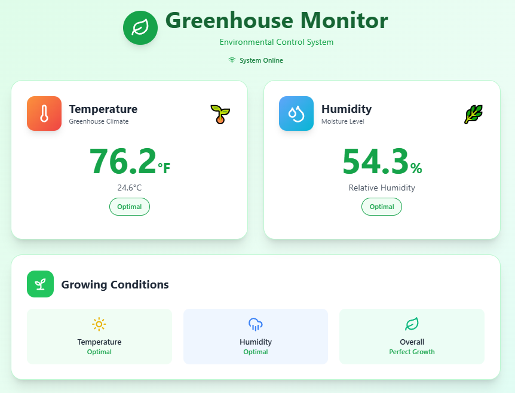

# Greenhouse Monitor

Raspberry Pi Greenhouse Environmental Monitor with DHT11 sensor


## Overview

Greenhouse Monitor is a full-stack TypeScript application for monitoring and recording environmental conditions in a greenhouse using a Raspberry Pi and DHT11 temperature/humidity sensor. The project includes a React-based dashboard with real-time sensor readings and system monitoring.

## Features

- Real-time temperature and humidity monitoring
- Automatic classification of growing conditions
- 16x2 LCD display support with sleep mode to prevent screen burn-in
- Raspberry Pi system monitoring (CPU temperature, memory, disk usage)
- Beautiful React dashboard with responsive design using Tailwind CSS
- Historical data logging with configurable intervals
- Development mode with hardware simulation for testing without a Raspberry Pi
- **AI-Powered Development**: Custom GitHub Copilot agents for brainstorming, coding, and code review
- **Automated Workflows**: GitHub Actions integration for issue triage, PR reviews, and deployment

## Hardware Requirements

- Raspberry Pi (any model with GPIO pins)
- DHT11 temperature and humidity sensor
- Optional: 16x2 LCD display (I2C interface)

## Software Prerequisites

- Node.js 20.x or higher
- npm or yarn package manager
- Raspberry Pi OS (for deployment to Raspberry Pi)
- I2C enabled on the Raspberry Pi (for LCD display)

## Installation

1. Clone the repository:
   ```bash
   git clone https://github.com/yourusername/greenhouse-monitor.git
   cd greenhouse-monitor
   ```

2. Install dependencies:
   ```bash
   npm install
   ```

3. Build the application:
   ```bash
   npm run build
   ```

## Running the Application
Run from terminal:
```bash
npm run dev:server
```
OR

Install as a systemd service:

1. Create greenhouse-monitor.service file in /etc/systemd/system/
```bash
sudo vi /etc/systemd/system/greenhouse-monitor.service
````
Add the following configuration:
```bash
[Unit]
Description=Greenhouse Monitor
After=network.target

[Service]
Type=simple
User=<pi-user>
WorkingDirectory=<path/to>/greenhouse-monitor
ExecStart=/usr/bin/npm run start:pi
Restart=on-failure
RestartSec=10
StandardOutput=syslog
StandardError=syslog
SyslogIdentifier=greenhouse-monitor
Environment=NODE_ENV=production

# Give the process time to clean up
TimeoutStopSec=10

[Install]
WantedBy=multi-user.target

```

2. Enable and start the service:
```bash
sudo systemctl enable greenhouse-monitor
sudo systemctl start greenhouse-monitor
```
3. Stop the service:
```bash
sudo systemctl stop greenhouse-monitor

```


### Development Environment (Simulated Hardware)

For development on computers without connected sensors:

## 🤖 AI-Powered Development Workflow

This project includes custom GitHub Copilot agents and automated workflows to streamline development.

### Custom Agents

Located in `.github/agents/`, these agents provide specialized assistance:

- **🧠 Brainstorming Agent**: Explore ideas, plan features, think through technical decisions
- **💻 Coding Agent**: Write, modify, and improve code with deep project knowledge
- **🔍 Code Review Agent**: Review changes for quality, security, and best practices

### Automated Workflows

GitHub Actions workflows automatically assist with:

- **Issue Triage**: Auto-labels issues based on content and suggests agent workflows
- **PR Reviews**: Adds review checklists and reminders to use code review agent
- **Deployment**: Updates issues and notifies about deployment status after merges
- **Label Management**: Maintains consistent labeling system across repository

### Issue Creator Agent

The project includes a powerful CLI tool for bulk-creating GitHub issues from markdown templates:

```bash
# Preview what will be created
npm run create-issues:dry-run

# Create all issues from templates
npm run create-issues

# Create a specific issue
npm run create-issues -- --file=ISSUE_01_local_storage_mqtt_reliability.md
```

**Features:**
- ✅ Automatically parses issue templates with labels and milestones
- ✅ Checks for existing issues to avoid duplicates
- ✅ Dry-run mode for safe testing
- ✅ Rate limiting to respect GitHub API limits

See [scripts/README.md](scripts/README.md) for setup and usage details.

### Using the Agents

In GitHub Copilot Chat, reference agents with:
```
@brainstorming How should we add temperature alerts?
@coding Implement a new endpoint for sensor history
@code-review Review the changes in server.ts
```

### Quick Start with Workflows

1. **Create an issue** → Gets auto-labeled with suggested workflow
2. **Use suggested agent** → Get guidance on implementation
3. **Create PR** → Receives review checklist automatically
4. **Merge** → Related issues updated with deployment info

For detailed workflow documentation, see:
- [Workflow Guide](.github/workflows/README.md)
- [Agent Documentation](.github/agents/README.md)
- [Agent Workflows](.github/AGENT_WORKFLOWS.md) (auto-generated)

## 🚀 Future Enhancements

### Long-Term Storage & Year-over-Year Analysis

We have a comprehensive plan for adding multi-year data retention and historical analysis capabilities:

📋 **[Executive Summary](docs/EXECUTIVE_SUMMARY.md)** - Quick overview of the enhancement plan

📖 **[Implementation Roadmap](docs/IMPLEMENTATION_ROADMAP.md)** - Step-by-step guide with troubleshooting

🏗️ **[Technical Plan](docs/LONG_TERM_STORAGE_PLAN.md)** - Detailed architecture and design

🎫 **[GitHub Issues](docs/github-issues/)** - Ready-to-use issue templates for each phase

**What you'll get**:
- 14-day local storage (up from 7 days)
- Multi-year data retention in MariaDB on Kubernetes
- Automated weekly backups to Synology NAS
- Year-over-year comparison dashboard
- 5-day offline alert automation
- Support for outdoor sensor comparison (future)

**Time investment**: 12-18 hours over 2-3 weeks

**Cost**: $0 (uses existing K8s cluster and NAS)
